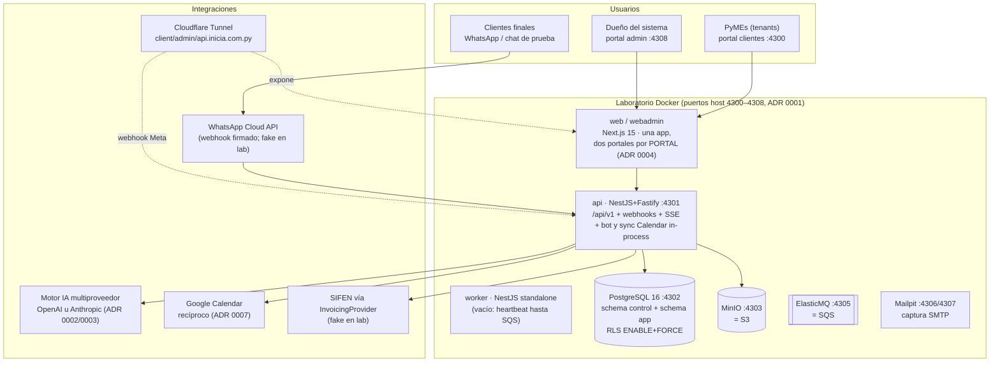

# Mapa de arquitectura — SaaS de Gestión para PyMEs

**Fecha:** 2026-08-26 · **Fuentes:** docs/plan (arquitectura aprobada), docs/adr
(desvíos aceptados 0001–0009) y el código real del repo a esta fecha.

Este documento es el mapa de orientación: qué es el producto, cómo está armado
hoy y dónde vive cada cosa. No reemplaza a docs/plan (que sigue siendo la fuente
de verdad de la arquitectura) ni a los ADR; los referencia.

---

## 1. Propósito y público

**Qué es:** plataforma SaaS multitenant de gestión integral para PyMEs de
servicios de Paraguay (peluquerías, talleres, consultorios, estudios): CRM de
clientes finales, catálogo de servicios e ítems, agenda con empleados
agendables, bandeja de WhatsApp con bot de IA que atiende y agenda solo, y
facturación electrónica SIFEN. Monto en guaraníes, zona America/Asuncion,
español como idioma del producto.

**Dos audiencias, dos portales:**

- **Tenants (las PyMEs clientes):** operan su negocio en el portal de clientes.
  Roles `root` / `admin` / `staff`; solo el root ve integraciones y secretos.
- **El dueño de la plataforma:** administra tenants, planes, features,
  overrides, presupuesto de IA por tenant y el motor del bot desde un portal
  admin separado (ADR 0004), con su propio login (`padmin` / `pagent`).

**Modelo comercial:** planes como datos (`plans`/`features`/`plan_features` +
`tenant_feature_overrides`): crear un plan o pactar un acuerdo a medida es un
INSERT desde el panel admin, no un deploy. `FeatureGuard` apaga módulos enteros
por plan sin tocar código.

---

## 2. Vista de conjunto

Monolito modular multitenant en TypeScript de punta a punta (docs/plan/01).
Hoy todo corre en el **laboratorio local Docker** (docs/plan/11); AWS no está
encendido aún.



**Principio del plan:** la API responde rápido y encola; el worker hace lo
lento. **Estado real:** el worker existe pero está vacío (solo heartbeat,
`apps/worker/src/main.ts`); el bot, la sincronización de Google Calendar y el
resto del trabajo asíncrono corren **in-process en la API** (best-effort con
log, ADR 0007 amendment). El pase a SQS+worker es el hardening pendiente para
producción; ElasticMQ ya está en el compose para conservar la paridad.

---

## 3. Aislamiento multitenant: la regla número uno

El riesgo dominante del proyecto es el cruce de datos entre tenants
(docs/plan/05: "mata el negocio"). Defensa en profundidad con **cuatro
barreras independientes**, todas implementadas:

| # | Barrera | Dónde vive en el código |
|---|---------|-------------------------|
| 1 | El `tenant_id` sale **solo del JWT** (claim `tid`), jamás del body/query | `apps/api/src/auth/` (guards + `tenant-ctx.ts`) |
| 2 | Toda operación de datos de tenant corre dentro de una transacción que fija el tenant con `SET LOCAL app.tenant_id` | `AppPrisma.tx()` → `tenantTx()` en `packages/db/src/index.ts` |
| 3 | **RLS con `ENABLE`+`FORCE` y fallo cerrado** en las 24 tablas del esquema `app`: sin tenant en sesión, cero filas; el rol `app_rw` no tiene `BYPASSRLS` | `infra/local/init/01-schema.sql` + migraciones en `packages/db/prisma/migrations/` |
| 4 | **FKs compuestas `(tenant_id, id)`**: una hija no puede apuntar a un padre de otro tenant ni por bug | DDL de las migraciones |

**Verificación bloqueante (docs/plan/08 §2):** dos suites que corren en cada
push de CI y que son la definición de terminado de cualquier tarea que toque
datos:

- `packages/db/src/tests/isolation.test.ts` — capa SQL/ORM: casos 3, 4, 5 y 10
  (lectura cruzada tabla por tabla sobre las 24 tablas, fallo cerrado sin
  tenant, FKs compuestas, vistas con `security_invoker`, suplantación de
  tenant_id, auditoría). Requiere `MIGRATOR_DATABASE_URL`.
- `apps/api/test/isolation-api.e2e.test.ts` — capa API: casos 1, 2 y 6 (404
  opaco indistinguible de inexistente, listados filtrados, `/integrations`
  solo root).

Se corre todo con `pnpm test` (turbo) con el laboratorio levantado.
**Toda tabla nueva del esquema `app` debe nacer con `tenant_id`, RLS
ENABLE+FORCE, política `tenant_isolation`, y sumarse a `APP_TABLES` de la
suite.**

Refuerzos adicionales: 404 opaco en la API (un recurso ajeno responde igual
que uno inexistente), guards de 3 capas (JWT → rol/sucursal → feature), y en
el bot el scoping estructural de la sección 6.

---

## 4. Estructura del repo (qué hace cada pieza)

Monorepo pnpm + Turborepo, Node ≥ 22, TypeScript `strict`.

```
apps/
  web/          Next.js 15 + Tailwind. UNA app, DOS portales según PORTAL
                (ADR 0004; la partición la hace middleware.ts en el server):
                  portal clientes (:4300): /login, /app{,/customers,/catalog,
                    /schedule,/employees,/inbox,/invoices,/team,/settings}
                    y /chat (simulador de cliente final por el pipeline real)
                  portal admin  (:4308): /platform{,/login,/tenants/[id]}
  api/          NestJS + Fastify. Módulos: auth (JWT RS256 + refresh rotativo,
                guards de rol/feature), platform (tenants, planes, overrides,
                platform_settings: motor del bot y OAuth Google del sistema,
                operadores, guard de IPs), tenant (empresa, sucursales,
                usuarios, empleados/RRHH), crm (customers + contactos tipados,
                campos personalizados, actividades), catalog, scheduling
                (turnos, disponibilidad, anti-solape por advisory lock),
                conversations (bandeja, webhooks WhatsApp firmados, SSE,
                bot.service que orquesta el motor IA, inactividad, envío WA),
                bot (ajustes del bot del tenant), integrations (credenciales
                cifradas + google-calendar.service recíproco), invoicing
                (facturas, numeración con lock, KuDE PDF con pdfkit+qrcode),
                cobros pendientes (2026-09-08: /app/cobros elige qué consumos
                facturar, atraso > 1 mes en rojo, aviso de cuenta pendiente),
                padrón RUC de la DNIT (ADR 0012: cron mensual in-process en
                platform/ruc-padron.service + GET /ruc/:ruc que autocompleta
                razón social y DV en clientes y facturas),
                common (crypto envelope, rate limit, problem+json RFC 7807,
                zod pipe), prisma (AppPrisma.tx = contrato RLS; PlatformPrisma)
  worker/       NestJS standalone. VACÍO (heartbeat): los consumidores SQS
                llegan con el hardening de producción.
packages/
  db/           schema.prisma (34 modelos, esquemas control y app),
                15 migraciones (20260804 init → 20260826 crm_extendido),
                seed de desarrollo, tenantTx() y la SUITE DE AISLAMIENTO SQL.
  shared/       DTOs zod por dominio (la única definición de formas de datos:
                la API valida y el front tipa con lo mismo), validadores (RUC,
                E.164), env.ts con esquema zod (la app NO arranca si falta o
                sobra una variable).
  botengine/    Motor del bot agnóstico del proveedor (ADR 0002): tools con
                JSON Schema y ejecución server-side, turno de conversación
                con implementación anthropic y openai, prompt de 3 capas
                (ADR 0008) en buildSystem/DEFAULT_BASE_PROMPT.
  wa/           Cliente WhatsApp Cloud API (y soporte del chat de prueba).
  invoicing/    Interfaz InvoicingProvider + fake (CDC sintético) para lab.
infra/
  local/        init SQL de la instancia (roles migrator/app_rw NOBYPASSRLS,
                esquemas, app.current_tenant()) + config ElasticMQ.
docs/
  plan/         LA ARQUITECTURA APROBADA (11 documentos + README).
  adr/          Desvíos aceptados: 0001 puertos 4300–4308 · 0002 bot
                multiproveedor · 0003 config del motor en panel padmin ·
                0004 portal admin separado · 0005 el tenant es la ficha CRM
                de plataforma · 0006 ledger y corte de presupuesto IA ·
                0007 Google Calendar recíproco · 0008 prompt en 3 capas ·
                0009 empleados agendables + catálogo tipado · 0012 padrón
                RUC de la DNIT (copia local mensual en `control`).
  propuestas/   Replanteos de producto en evaluación (2026-08-26: módulos
                estilo Bitrix24, P1/P2/P3).
  qa/           Reportes de las baterías de prueba del bot.
.github/workflows/ci.yml   init SQL → migraciones → lint → build → typecheck
                           → tests (incluye aislamiento, bloqueante)
docker-compose.dev.yml     laboratorio completo (ADR 0001) + Cloudflare Tunnel
```

---

## 5. Modelo de datos

Una sola instancia PostgreSQL 16, **dos esquemas** (docs/plan/01 §6):

- **`control` (10 modelos):** lo del dueño — PlatformUser, Feature, Plan,
  PlanFeature, Tenant (que además es la ficha CRM del cliente de la
  plataforma, ADR 0005), TenantFeatureOverride, Subscription, PlatformInvoice,
  PlatformSetting (config operativa: motor del bot, OAuth Google; secretos
  cifrados, ADR 0003), PlatformAuditLog.
- **`app` (27 modelos, todos con `tenant_id` + RLS):** Branch, User,
  UserBranchAccess, RefreshToken, Customer (+ CustomerContactPoint,
  CustomFieldDef, CustomerActivity — CRM extendido 2026-08-26),
  ServiceCategory, Service (catálogo tipado `servicio|item`, ADR 0009),
  ServicePhoto (fotos en bytea, ADR 0010), Appointment (con
  `reminder_sent_at`), Employee (RRHH + agendables, ADR 0009), CalendarBlock
  (eventos ajenos de Google que bloquean agenda), Conversation, Message,
  BotSettings (permisos del bot + link de Meet + recordatorios),
  BotUsageMonthly (ledger de tokens, ADR 0006), BotToolCall (trazabilidad de
  herramientas), Invoice, InvoiceItem, Payment, Quote, QuoteItem
  (presupuestos sin carácter fiscal, ADR 0010), IntegrationCredential
  (secretos con envelope encryption; por tenant y por empleado),
  NotificationEmail, AuditLog.

Convenciones no negociables (docs/plan/02 y 03): dinero en `bigint` PYG sin
decimales, jamás floats; `timestamptz` UTC; soft delete `deleted_at` en lo
editable y **nunca** en invoices/messages/audit_log; índices únicos parciales
conviviendo con soft delete; triggers de auditoría con before/after (sin
secretos ni hashes); UUID como PK salvo tablas append-only (`messages`,
`audit_log` en bigint).

**Migraciones: nunca se edita una ya aplicada.** Cambios de esquema =
migración nueva, expand-and-contract.

---

## 6. El bot de WhatsApp (la superficie más delicada)

Flujo real: webhook de Meta (o chat de prueba) → verificación de firma
`X-Hub-Signature-256` → identificación del tenant por `phone_number_id` →
conversación (una viva por número) → si el bot está activo y la conversación
no está en `paused`/`agent`, `bot.service` arma el turno con
`@pymes/botengine` y responde; todo mensaje y tool call queda persistido.

Reglas de seguridad (docs/plan/05 §6 + ADR 0008, todas server-side):

1. **Permiso apagado = la herramienta no existe** en la llamada al modelo
   (casillas de `bot_settings`). Tools actuales: `list_services`,
   `get_available_slots`, `book_appointment`, `save_customer_name`,
   `save_customer_data`, `get_customer_history`, `request_human`.
2. **Scoping estructural:** cada tool ejecuta amarrada al tenant y a la
   conversación bajo RLS; no existe herramienta capaz de cruzar tenants ni de
   consultar por un teléfono arbitrario, diga lo que diga el prompt.
3. **Prompt en 3 capas** (ADR 0008): reglas de seguridad en código (no
   editables) → guía estándar del dueño (editable en panel admin, variables
   `{{...}}`) → instrucciones del tenant (datos, no privilegio; flag de
   consentimiento para que primen sobre la guía, nunca sobre la capa 1).
4. **Presupuesto de IA por tenant** (ADR 0006): ledger mensual + corte; el
   presupuesto lo edita solo el dueño. Registrado aunque no haya respuesta.
5. El nombre JAMÁS es requisito para atender (regla dura post-QA); registro
   de cliente después de resolver el pedido, una sola vez.
6. Guía operativa completa para tocar el bot: memoria `guia-bot-whatsapp` y
   reportes en `docs/qa/bot/`. Batería de regresión: skill `testear-bot`.

Motor multiproveedor (ADR 0002/0003): OpenAI o Anthropic, elegido y con llaves
rotables desde el panel padmin (`platform_settings.bot_engine`, cache 30 s,
env solo como fallback de laboratorio).

---

## 7. Estado actual respecto del roadmap (docs/plan/07)

**Implementado y operando en el laboratorio** (fase 1 completa + la mayor
parte de fase 2 + adelantos de fase 3):

- Fundaciones: auth JWT+refresh rotativo, RBAC 3 capas, RLS, auditoría, CI
  con suite de aislamiento bloqueante.
- Panel plataforma: tenants (alta con contacto CRM, reset de contraseñas,
  presupuesto IA), planes/features/overrides, operadores, motor del bot,
  restricción por IP opcional.
- CRM extendido (2026-08-26): multifield de contactos, campos personalizados
  por tenant, tags/origen/responsable/rating, timeline propio.
- **P1 del replanteo COMPLETA (2026-08-28, ADR 0010):** ficha CRM completa en
  el panel + Ajustes → Campos del cliente, bandeja de tareas transversal (el
  "Seguimiento:" del resumen del bot crea tarea), dashboard con KPIs en el
  inicio, fotos de catálogo, presupuestos formales quote → factura con PDF,
  reprogramar/cancelar turnos por chat (3 tools nuevas del bot) y
  recordatorios de turno por WhatsApp (barrido in-process, plantillas Meta
  por tenant).
- Catálogo tipado, agenda con empleados agendables (anti-solape por advisory
  lock, auto-asignación, horarios propios), RRHH.
- Bandeja de chat con SSE, bot completo con QA intensivo (7/7 hallazgos
  resueltos), Google Calendar recíproco por negocio y por empleado.
- Facturación con provider fake (borrador → emisión → CDC sintético → KuDE
  PDF → pagos).

**Pendiente para producción** (docs/propuestas/2026-08-26): worker con tareas
reales + SQS, SIFEN real, envío de emails real, pasarela de pagos, cobro de
mensualidades, AWS (Terraform del plan 06 aún no aplicado), KMS, TOTP,
META_APP_SECRET y credenciales oficiales de WhatsApp por tenant, app OAuth de
Google "In production".

---

## 8. Entornos y operación

- **Laboratorio local (docs/plan/11 + ADR 0001):** `docker-compose.dev.yml`
  con puertos host 4300–4308 (web 4300, api 4301, db 4302, MinIO 4303/4304,
  ElasticMQ 4305, Mailpit 4306/4307, webadmin 4308). Nunca 3000/3001/5432 en
  el host. Arranque y credenciales de seed: README.md.
- **Exposición remota:** Cloudflare Tunnel hacia `client/admin/api.inicia.com.py`
  (token en `.env.local`, rutas remotas en Cloudflare, API con trustProxy).
  También provee el webhook público para Meta.
- **Config: nada hardcodeado.** Parámetros del sistema → panel padmin
  (`platform_settings`); parámetros del cliente → su panel; en código solo
  `DEFAULT_*` y pisos técnicos. Endpoints, buckets, colas y hosts siempre por
  variable de entorno validada en `packages/shared/env.ts`.
- **CI (GitHub Actions):** Postgres de servicio + init SQL real (roles y RLS)
  → migraciones como `migrator` → lint → build → typecheck → tests. La suite
  de aislamiento en rojo bloquea el merge.
- **Comandos:** `pnpm dev|build|typecheck|lint|test`;
  `pnpm --filter @pymes/db run db:migrate` / `db:seed`.

---

## 9. Reglas de trabajo (síntesis operativa)

1. **Aislamiento primero:** tabla nueva de `app` nace con tenant_id + RLS
   FORCE + FK compuesta + caso en la suite. Ninguna tarea que toque datos
   termina sin la suite en verde.
2. Leer el documento de docs/plan relevante antes de la tarea; desvío ⇒ ADR.
3. Nunca editar migraciones aplicadas.
4. Nada fijo en el código (endpoints, buckets, hosts, parámetros de negocio).
5. Los DTOs zod de `packages/shared` son la única definición de formas de
   datos; el server siempre recalcula (totales, IVA, disponibilidad,
   numeración).
6. 404 opaco para recursos ajenos; los secretos jamás salen por la API ni
   entran al audit log.
7. Toda tool nueva del bot: permiso que la habilita, scoping por
   tenant+conversación, registro en `bot_tool_calls`, y batería `testear-bot`
   tras cambios de comportamiento.
