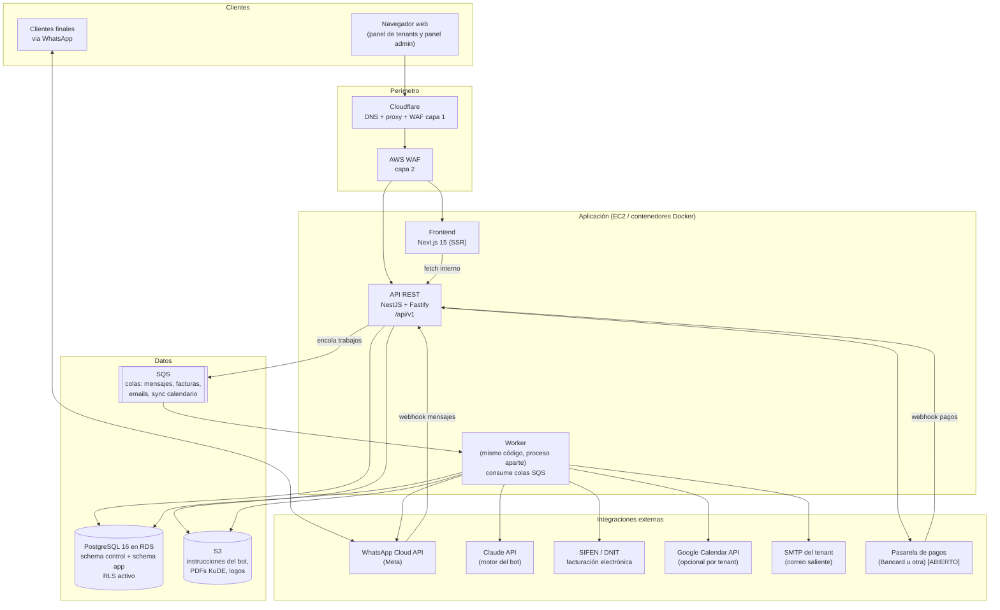
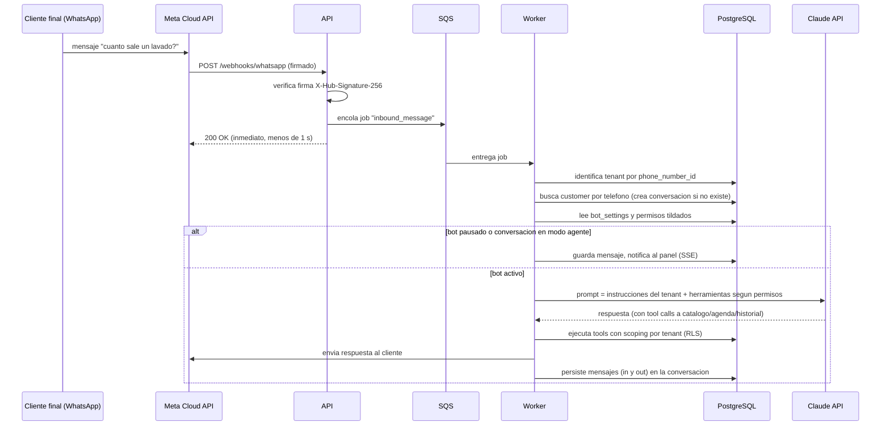
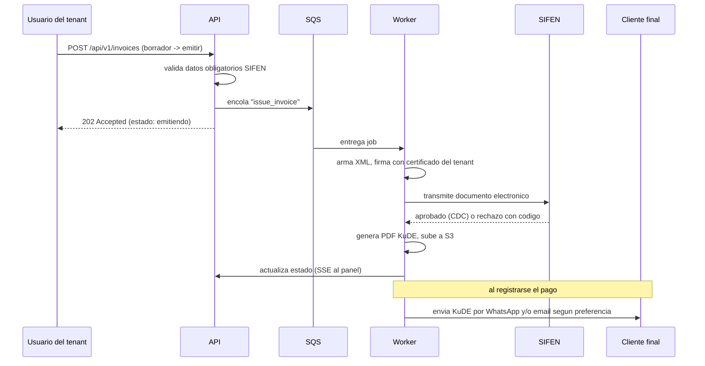

# 01 · System Architecture Diagram
## Arquitectura general de la solución

---

## 1. Visión de conjunto

La solución es un **monolito modular multitenant** desplegado en AWS: una sola aplicación consolidada que sirve a todos los clientes (tenants), con aislamiento estricto de datos, colas para todo lo asíncrono y integraciones externas desacopladas detrás de interfaces propias. Se elige monolito modular y no microservicios porque el equipo inicial es chico, el presupuesto es acotado y los límites de módulos bien definidos permiten extraer servicios más adelante si hiciera falta, sin pagar hoy el costo operativo de operar diez servicios.



**Principio rector:** la API responde rápido y encola; el worker hace todo lo lento o lo que depende de terceros (WhatsApp, SIFEN, emails, PDFs, IA, sincronización de calendarios). Así una caída o lentitud de un tercero nunca tumba la experiencia del panel.

---

## 2. Componentes y responsabilidades

| Componente | Responsabilidad | No es responsable de |
|---|---|---|
| **Frontend (Next.js)** | Panel de tenants, panel de agentes, panel admin global. SSR para carga rápida en móviles. Toda la UI. | Lógica de negocio y permisos (solo refleja lo que la API autoriza) |
| **API (NestJS)** | Autenticación, autorización, reglas de negocio, validación, endpoints REST, recepción de webhooks, encolado | Trabajos lentos o dependientes de terceros |
| **Worker** | Consumo de colas: envío de mensajes WA, motor del bot (Claude), emisión y eventos SIFEN, generación de PDFs KuDE, envío de emails, sync Google Calendar, reintentos con backoff | Atender requests HTTP de usuarios |
| **PostgreSQL (RDS)** | Única fuente de verdad de datos estructurados. RLS como segunda barrera de aislamiento | Archivos binarios |
| **S3** | Archivos: instrucciones del bot (versionado nativo), PDFs de facturas, logos | Datos estructurados |
| **SQS** | Desacople y resiliencia: colas estándar + dead letter queues por tipo de trabajo | Estado de negocio |

---

## 3. Flujos de comunicación principales

### 3.1 Mensaje entrante de WhatsApp (el flujo más importante)



Claves del diseño: el webhook responde 200 de inmediato (Meta reintenta si no); la identidad del tenant sale del `phone_number_id` del payload, nunca del contenido; las herramientas del bot se construyen **en el servidor** según las casillas de permisos, de modo que un permiso no tildado significa que la herramienta ni siquiera existe para el modelo.

### 3.2 Emisión de factura electrónica



La anulación sigue el mismo patrón: evento de cancelación si está dentro de las 48 horas de la aprobación, Nota de Crédito Electrónica si ya pasó el plazo. El motivo es obligatorio y dispara el email de aviso al cliente final.

### 3.3 Agendamiento por bot con confirmación manual

1. El bot (worker) consulta disponibilidad con la herramienta `get_available_slots` (solo si el permiso de calendario está tildado).
2. Crea el turno con estado `pending` y origen `bot`.
3. El panel muestra el turno con su botón **Confirmar agendamiento** (si el tenant configuró confirmación manual; si configuró automática, nace `confirmed`).
4. Al confirmar, se notifica al cliente por WhatsApp y, si el tenant tiene Google Calendar conectado, el worker crea el evento espejo.

### 3.4 Chat en vivo con toma de control

- El panel mantiene una conexión **SSE** (Server-Sent Events) por tenant para recibir mensajes en tiempo real. Se elige SSE sobre WebSockets en fase 1 por simplicidad operativa (HTTP puro, sin sticky sessions); WebSockets queda como mejora de fase 3 si el volumen lo pide.
- Pausar el bot cambia `conversations.status` a `paused` o `agent`; el worker respeta ese estado antes de invocar la IA.
- Todo mensaje del agente humano sale por la misma cola de envío que usa el bot.

---

## 4. Stack tecnológico y justificación

**[DECISIÓN] TypeScript de punta a punta.** Un solo lenguaje para frontend, API y worker reduce el costo de contexto, permite compartir tipos y validaciones entre capas, y coincide con el stack que ya manejás (Next.js, Prisma, TypeScript), lo que baja el riesgo del proyecto y hace más productivo el trabajo con Claude Code.

| Capa | Elección | Justificación | Alternativas descartadas y por qué |
|---|---|---|---|
| Frontend | **Next.js 15 (App Router) + Tailwind CSS + shadcn/ui + TanStack Query** | SSR para carga rápida en redes móviles de Paraguay; ecosistema enorme; ya lo dominás; shadcn da componentes accesibles sin lock-in | SPA pura con Vite (peor primera carga y SEO del sitio público); Angular (curva y verbosidad sin beneficio acá) |
| API | **NestJS 11 sobre Fastify** | Estructura de módulos, inyección de dependencias, guards e interceptors ideales para RBAC multitenant; OpenAPI/Swagger integrado; testeable; TypeScript nativo | Express puro (sin estructura, cada dev inventa la suya); Next.js API routes (insuficiente para worker, colas, webhooks firmados y un dominio de este tamaño) |
| ORM | **Prisma** | Ya lo usás; migraciones versionadas; tipado end-to-end; productividad alta con Claude Code | SQL crudo total (lento de desarrollar, propenso a errores); TypeORM (menos ergonómico); Drizzle (válido, pero Prisma gana por tu experiencia previa) |
| Base de datos | **PostgreSQL 16 en RDS** | Relacional sólido para facturación y CRM; **Row Level Security** nativo como segunda barrera de aislamiento multitenant; JSONB para flexibilidad puntual; es el mismo motor que Supabase, así que tu experiencia aplica directa | MySQL (sin RLS nativo comparable); DynamoDB (el dominio es fuertemente relacional); Supabase gestionado (agregaría un proveedor más fuera de AWS; acá se usa Postgres puro con las mismas ideas) |
| Colas | **AWS SQS + DLQ** | Sin servidores que mantener, costo por uso casi nulo al inicio, reintentos y dead letters nativos; respeta la decisión de arrancar sin Redis | BullMQ (exige Redis desde el día uno); RabbitMQ (una pieza más que operar) |
| Tiempo real | **SSE en fase 1** | Simple, HTTP puro, suficiente para bandeja de chat y estados de factura | WebSockets (se reevalúa en fase 3 con más volumen) |
| Motor del bot | **Claude API (modelo económico, Haiku) con tool use** | Tool use permite que los permisos del tenant definan qué herramientas existen; instrucciones del tenant como parte del prompt; costo controlado por tenant con presupuesto mensual configurable | Modelos self-hosted (calidad y mantenimiento no justifican al inicio) |
| Canal WhatsApp | **WhatsApp Cloud API oficial (Meta)** | Es la vía oficial: sin riesgo de baneo, webhooks firmados, ventana de 24 horas y plantillas bien definidas. El tenant carga su propio token y phone_number_id | Librerías no oficiales tipo Baileys (riesgo de bloqueo del número del cliente: inaceptable para un producto comercial) |
| Facturación electrónica | **Interfaz propia `InvoicingProvider` con dos implementaciones posibles** | Desacopla el dominio de la vía de transmisión y permite decidir sin rehacer nada | Ver punto [ABIERTO] abajo |
| PDFs (KuDE) | **pdfmake en el worker** | Liviano, sin browser headless, apto para la instancia chica | Puppeteer (pesado en RAM para la fase inicial) |
| Email | **Nodemailer con SMTP del tenant** | Decisión de negocio: el correo sale desde la cuenta del cliente; credenciales cifradas; cola con reintentos | SES propio (queda como opción futura si ofrecemos correo como servicio) |
| Autenticación | **Propia: Argon2id + JWT de acceso corto + refresh token rotativo** | Control total del modelo jerárquico (plataforma, tenant, sucursal), sin costo por usuario ni lock-in | Cognito (los roles jerárquicos custom y el multitenant se vuelven incómodos); Auth0 (costo por usuario activo) |
| Infraestructura | **Docker en EC2 (fase 1) con camino a ALB + Auto Scaling (fase de escala)** | Coincide con tu plan declarado: una instancia económica primero, escalar con balanceador después; Docker desde el día uno hace el salto trivial | Detalle completo en documento 06 |

**[ABIERTO] SIFEN, dos caminos dentro de la misma interfaz:**

- **Opción A, integración directa:** el worker arma el XML, lo firma con el certificado digital del tenant y lo transmite a los servicios de SIFEN. Costo por factura: cero. Costo de desarrollo: alto (homologación, set de pruebas de la DNIT, mantenimiento ante cambios normativos).
- **Opción B, proveedor homologado local vía API:** se paga un costo por documento o mensualidad a un tercero paraguayo ya homologado. Time-to-market mucho menor y menor riesgo regulatorio; margen menor.

Recomendación: **arrancar con la Opción B para llegar rápido al mercado, migrando a la Opción A cuando el volumen de facturas justifique el desarrollo propio.** La interfaz `InvoicingProvider` hace que ese cambio no toque el resto del sistema. Decisión final tuya con números de proveedores en la mano.

---

## 5. Estructura del monolito modular

```
apps/
  web/          Next.js (panel tenants + panel admin + sitio)
  api/          NestJS (REST + webhooks + SSE)
  worker/       NestJS standalone (consumidores SQS)
packages/
  db/           schema Prisma + migraciones + seeds
  shared/       tipos, DTOs zod, constantes, utilidades
  invoicing/    interfaz InvoicingProvider + implementaciones
  wa/           cliente WhatsApp Cloud API
  botengine/    orquestacion Claude + definicion de tools
```

Módulos de dominio dentro de la API (uno por bounded context): `auth`, `platform` (tenants, planes, features, overrides), `identity` (usuarios, roles, sucursales), `crm` (customers), `catalog`, `scheduling`, `conversations`, `bot`, `invoicing`, `payments`, `notifications`, `integrations`, `audit`.

Regla de dependencia: los módulos solo se comunican por servicios públicos exportados; nada de imports cruzados de repositorios internos. Esa disciplina es la que mantiene extraíble cualquier módulo a futuro.

---

## 6. Decisión de base de datos: una instancia, dos planos

Respondiendo la pregunta pendiente de una base versus dos:

**[DECISIÓN] Una sola instancia física de PostgreSQL con dos esquemas lógicos:**

- `control`: lo nuestro. Tenants, planes, features, overrides, suscripciones, usuarios de plataforma, facturación de la plataforma a los tenants.
- `app`: lo de los clientes. Customers, catálogo, turnos, conversaciones, facturas de los tenants a sus clientes. **Todas las tablas de `app` llevan `tenant_id` y RLS activo.**

Por qué así y no dos instancias: con el presupuesto inicial, dos RDS duplican costo fijo sin beneficio real de seguridad (el aislamiento fuerte lo dan RLS más el scoping de la aplicación, no la separación física). Y la separación lógica por esquemas deja el camino pavimentado: si algún día conviene separar (por carga o por compliance), `control` se muda a su propia instancia con un cambio de connection string, sin refactor del modelo.

---

## 7. Manejo de errores y resiliencia (transversal)

- Toda integración externa pasa por la cola: reintentos con backoff exponencial (1 min, 5 min, 30 min, 2 h) y dead letter queue con alarma.
- Timeouts explícitos en cada cliente HTTP externo (WhatsApp 10 s, SIFEN 30 s, Claude 60 s, SMTP 20 s).
- Idempotencia: los webhooks de Meta y de la pasarela se deduplican por ID de evento; la emisión de facturas usa claves de idempotencia para no emitir doble.
- Circuit breaker simple por integración: tras N fallos consecutivos, se pausa el consumo de esa cola y se alerta, sin afectar al resto del sistema.
- El panel siempre muestra el estado real de los trabajos asíncronos (emitiendo, enviado, fallido con motivo) vía SSE.
