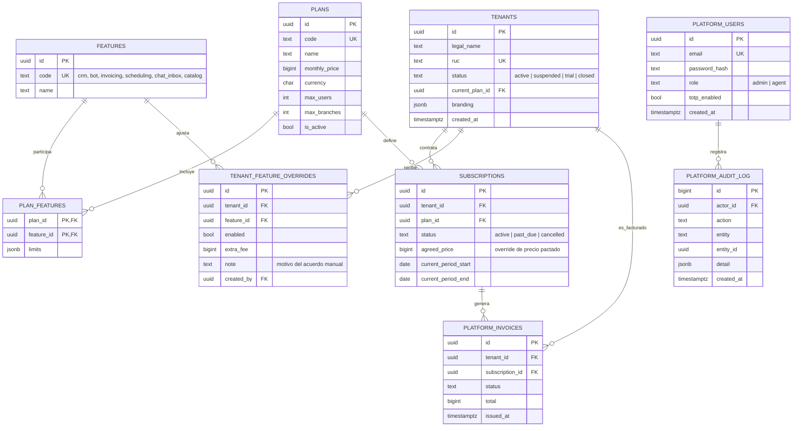
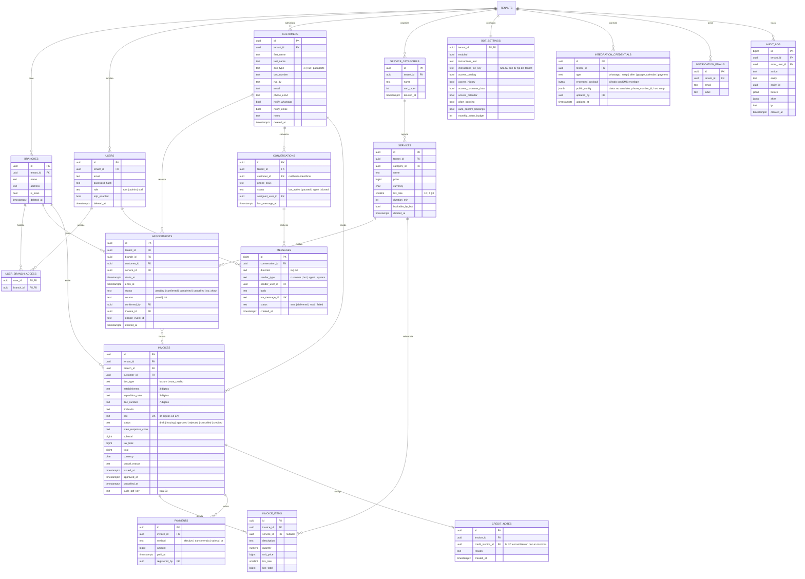

# 02 · Entity-Relationship Diagram (ERD)
## Modelo de datos conceptual

El modelo se divide en dos planos que viven en la misma instancia de PostgreSQL (ver documento 01, sección 6): el **plano de control** (esquema `control`, datos de la plataforma) y el **plano de aplicación** (esquema `app`, datos operativos de cada tenant). El DDL completo con tipos, índices y constraints está en el documento 03; acá se define el modelo y sus relaciones.

---

## 1. Plano de control (esquema `control`)

**Decisiones de modelado del plano de control**

- **Planes como datos, no como código [DECISIÓN]:** `plans`, `features`, `plan_features` y `tenant_feature_overrides` materializan tu requisito de que nada esté hardcodeado. Crear un plan nuevo o pactar un acuerdo a medida es un INSERT desde el panel admin, no un deploy. La resolución de acceso de un tenant a una feature es: override del tenant si existe, si no lo que diga su plan.
- **`limits` en JSONB:** los límites por feature (cantidad de usuarios, mensajes de bot por mes, facturas por mes) varían por feature; JSONB evita una tabla de límites por cada tipo. Se valida con esquema zod en la aplicación.
- **`agreed_price` en la suscripción:** el precio pactado vive en la suscripción para que cambiar el precio de lista de un plan no toque los acuerdos existentes.
- **Facturación de plataforma separada de la de tenants:** `platform_invoices` (lo que nosotros cobramos) es una entidad distinta de `app.invoices` (lo que los tenants facturan a sus clientes). Comparten conceptos pero no ciclo de vida ni normativa de acceso, y ambas terminan transmitiéndose a SIFEN por el mismo `InvoicingProvider`.

---

## 2. Plano de aplicación (esquema `app`)

Todas las entidades de este plano llevan `tenant_id` (omitido en el diagrama por legibilidad, salvo donde define la relación) y están protegidas por RLS.

---

## 3. Cardinalidades clave explicadas

| Relación | Cardinalidad | Nota de diseño |
|---|---|---|
| Tenant → Branches | 1 a N | Todo tenant nace con una sucursal `is_main`; el caso de un emprendedor solo es simplemente un tenant con una sucursal. Así el modelo de cadena y el de individuo son el mismo. |
| Users ↔ Branches | N a M vía `user_branch_access` | Un empleado puede atender en dos sucursales; el root ve todas sin filas explícitas (regla en la app). |
| Customer → Conversations | 1 a N (nullable) | Una conversación nace con el teléfono y `customer_id` NULL; se vincula al identificar por teléfono, email, cédula o RUC. El teléfono es la llave primaria de identificación; los demás son llaves secundarias de unificación. |
| Appointments ↔ Invoices | N a 1 opcional | Varias visitas pueden facturarse juntas; una visita puede no facturarse. El historial "qué se hizo y qué se facturó" sale de este vínculo más `invoice_items`. |
| Invoice → Credit Notes | 1 a 0..1 (extensible a N) | La NC es a su vez un documento electrónico: `credit_invoice_id` apunta a otra fila de `invoices` con `doc_type = nota_credito`. Reutiliza toda la maquinaria SIFEN. |
| Tenant → Bot settings | 1 a 1 | Fila creada al activar la feature; PK = tenant_id. |
| Tenant → Integration credentials | 1 a N (única por tipo) | Constraint único `(tenant_id, type)`: un solo WhatsApp, un solo SMTP por tenant en v1. |

## 4. Decisiones de modelado transversales

- **UUID como PK** en entidades de negocio (generación distribuida, no revelan volumen); `bigint` autoincremental solo en tablas de alto volumen append-only (`messages`, `audit_log`) donde el orden natural y el tamaño del índice importan.
- **Soft delete (`deleted_at`)** en entidades editables por el usuario (customers, services, appointments, branches, users). **Nunca** en `invoices`, `messages` ni `audit_log`: las facturas se anulan por estado y los mensajes y auditoría son inmutables.
- **Dinero en `bigint`** (guaraníes sin decimales) con `currency` explícita. Nada de floats, jamás.
- **Normalización 3FN como base**, con desnormalizaciones puntuales y justificadas: `line_total` en items y `subtotal/tax_total/total` en facturas se persisten (son datos fiscales congelados al emitir, no derivables si el precio del servicio cambia después). `last_message_at` en conversaciones evita un MAX() por fila en la bandeja.
- **Multimoneda preparada, no activada:** todo monto lleva moneda; la v1 opera solo PYG.
- **Identidad del cliente final:** unicidad parcial por tenant sobre `phone_e164`, `email` y `(doc_type, doc_number)` cuando no son NULL y no está borrado. La unificación de duplicados es una operación explícita del panel (merge), nunca automática silenciosa.
