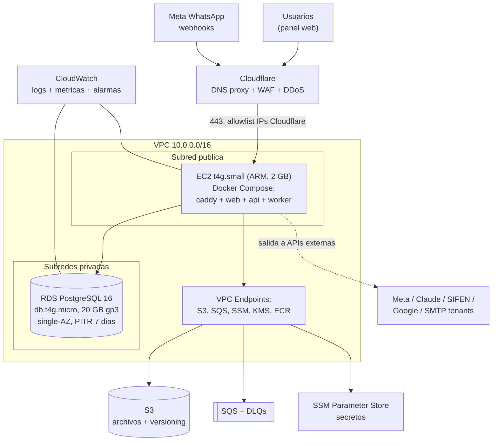
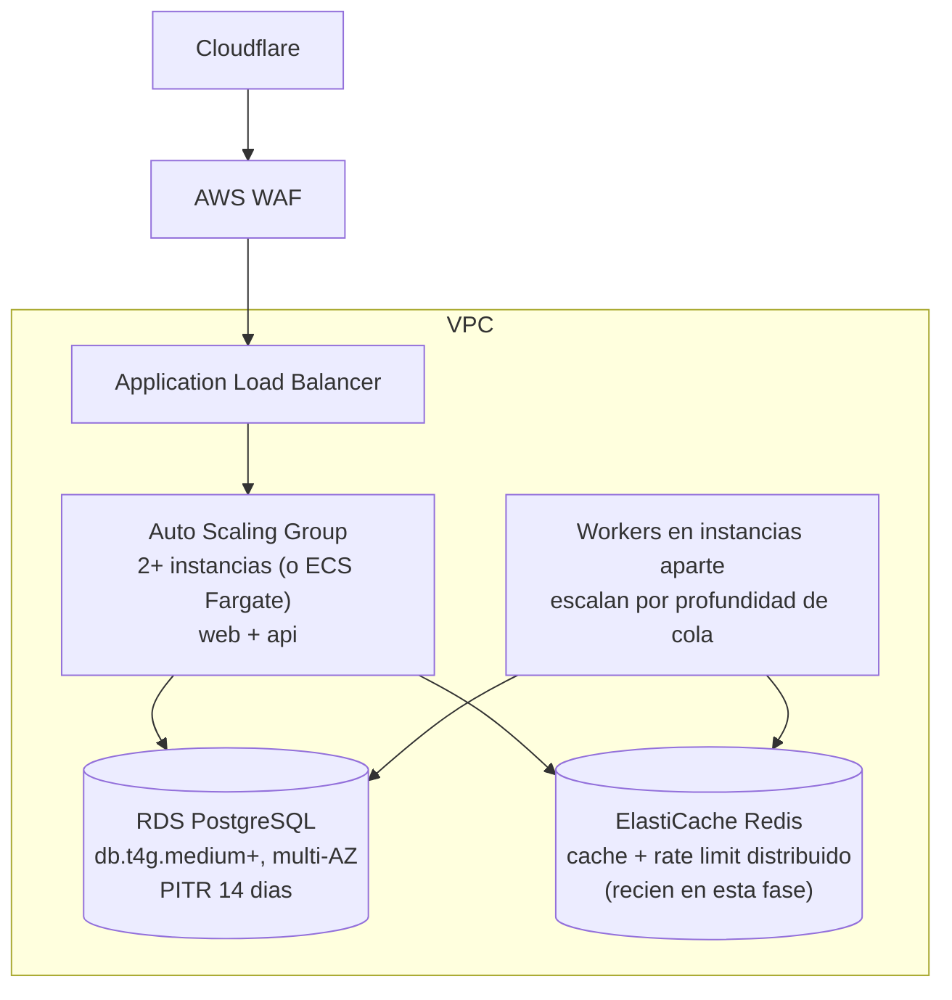
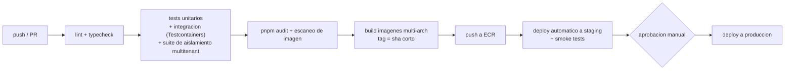

# 06 · Infrastructure / Deployment Diagram
## Topología AWS, ambientes, CI/CD y operación

Principio declarado del proyecto: **arrancar chico y barato, con el camino de escalado ya pavimentado.** Todo corre en contenedores Docker desde el día uno, de modo que pasar de una instancia a un clúster balanceado no cambia el código, solo dónde corren los mismos contenedores.

> **Nota de cuenta compartida:** esta infraestructura convive con otro proyecto en la misma cuenta de AWS. Antes de crear el primer recurso, aplicar las reglas de convivencia del **documento 10** (VPC y CIDR propios, prefijo `pymes-` en todos los nombres, tags obligatorios, cero recursos compartidos, roles IAM acotados, state de Terraform separado). El CIDR `10.0.0.0/16` usado más abajo está sujeto a verificación contra la VPC ya existente.

---

## 1. Fase 1: lanzamiento (objetivo: menos de 60 USD/mes)

**Composición de la instancia (docker compose):**

| Contenedor | Rol | Límite de memoria |
|---|---|---|
| `caddy` | Reverse proxy interno, TLS de origen, compresión | 64 MB |
| `web` | Next.js (modo standalone) | 512 MB |
| `api` | NestJS (REST + webhooks + SSE) | 512 MB |
| `worker` | Consumidores SQS | 512 MB |

Notas de la fase 1:

- **ARM (Graviton, t4g)** por precio/rendimiento; las imágenes se compilan multi-arch.
- **Single-AZ asumido y documentado como riesgo aceptado** (documento 09): el costo de multi-AZ no se justifica antes de tener ingresos; el RTO de 4 horas se cubre con backups + infraestructura como código.
- La IP pública solo acepta 443 desde los rangos de Cloudflare: nadie llega al origen directo. Sin SSH: administración por SSM Session Manager.
- **Staging barato:** mismos contenedores en la misma instancia bajo otro compose project y subdominio (`staging.`), con su propia base pequeña en el mismo RDS (base separada `app_staging`). Aislado por credenciales; suficiente hasta la fase de escala.

## 2. Fase de escala (se activa con métricas, no con ansiedad)

Gatillos: CPU sostenida mayor a 60%, p95 de la API sobre 400 ms, o primer cliente cadena grande.

Cambios de la fase de escala, en orden de necesidad:

1. **ALB + segunda instancia** (el compose pasa a servicio; la app ya es stateless: sesiones en DB, archivos en S3, colas en SQS).
2. **RDS multi-AZ** y tamaño según métricas; réplicas de lectura solo si reportes lo exigen.
3. **ElastiCache Redis:** cache de catálogo y features, rate limit distribuido. La interfaz `CacheService` ya existe en el código desde la fase 1 con implementación en memoria: activar Redis es cambiar el provider (decisión ya tomada en la fase de negocio: sin Redis al inicio, diseño preparado).
4. **Workers separados** escalando por `ApproximateNumberOfMessages`.
5. **Aurora PostgreSQL** solo si el volumen lo justifica (compatibilidad total, cambio de endpoint).
6. Particionamiento mensual de `messages` (procedimiento en documento 03).

## 3. Ambientes

| Ambiente | Dónde | Datos | Deploy |
|---|---|---|---|
| **dev** | Servidor local con Docker: Postgres, MinIO (S3), ElasticMQ (SQS), Mailpit. Ver **documento 11** | seeds sintéticos | manual |
| **test/CI** | GitHub Actions: Postgres efímero (Testcontainers) | generados por suite | cada push |
| **staging** | Subdominio en la instancia (fase 1) | anonimizados o sintéticos, **jamás copias crudas de producción** | automático al mergear a `main` |
| **prod** | Topología de arriba | reales | manual con aprobación (workflow dispatch) |

Paridad: mismas imágenes Docker en staging y producción; lo único que cambia son variables de entorno (12-factor). Ninguna configuración vive en el código.

## 4. Variables de entorno y secretos

- Definición única en `packages/shared/env.ts` con esquema zod: la app **no arranca** si falta o sobra una variable (fallo temprano y explícito).
- Producción y staging leen de **SSM Parameter Store** al boot (script de arranque las inyecta al contenedor); rotación documentada por secreto.
- Convención de nombres: `/pymes/{env}/{scope}/{clave}`, ej. `/pymes/prod/db/url`, `/pymes/prod/jwt/private_key`.
- Secretos de tenants (tokens WhatsApp, SMTP, SIFEN) **no** son variables de entorno: viven cifrados en la base (documento 05, sección 4.2).

## 5. CI/CD

- **Herramienta:** GitHub Actions (el repositorio vive en GitHub).
- **Migraciones de base:** paso previo al despliegue de contenedores, con patrón **expand and contract**: primero migraciones compatibles hacia atrás (agregar columnas y tablas), despliegue, y recién en una release posterior las destructivas (drops). Snapshot manual antes de toda migración.
- **Deploy en fase 1:** GitHub Actions ejecuta por SSM: `docker compose pull && docker compose up -d` (rolling por contenedor; el proxy mantiene el servicio).
- **Rollback:** cada release apunta a imágenes inmutables por SHA; volver atrás es fijar el tag anterior y repetir el `up -d` (menos de 5 minutos). Las migraciones expand-and-contract garantizan que el código anterior siga funcionando con el esquema nuevo.
- **Versionado:** `main` siempre desplegable; tags semver por release; changelog generado.

## 6. Monitoreo, alertas y métricas

| Capa | Herramienta | Qué se mira |
|---|---|---|
| Errores de aplicación | **Sentry** (plan free) | excepciones con trace_id, release y tenant (sin datos personales) |
| Logs | CloudWatch Logs (JSON) | retención 30 días; insights para consultas |
| Métricas de sistema | CloudWatch | CPU, memoria, disco de EC2 y RDS; conexiones de DB |
| Métricas de negocio técnico | CloudWatch custom | profundidad de colas y DLQs, latencia p95 de API, mensajes WhatsApp fallidos, facturas rechazadas por SIFEN, gasto de tokens IA por día |
| Disponibilidad externa | UptimeRobot (free) | `/health` desde fuera de AWS, cada minuto |

**Alarmas mínimas de producción (a un canal de Telegram o email):** instancia caída o healthcheck fallando 2 min; CPU RDS mayor a 80% por 10 min; almacenamiento RDS menor a 15%; cualquier mensaje en una DLQ; tasa de 5xx mayor a 1% por 5 min; p95 mayor a 800 ms por 10 min; certificado a menos de 15 días; presupuesto AWS excedido (AWS Budgets con tope mensual definido).

## 7. Infraestructura como código

Toda la infraestructura se define con **Terraform** en el propio repo (`/infra`): VPC, security groups, EC2, RDS, S3, SQS, IAM, alarmas. Beneficios directos para este proyecto: reconstrucción completa ante desastre (RTO), staging idéntico por definición, y revisión por PR de cualquier cambio de infraestructura (nada de clicks sin registro en la consola).

## 8. Costos estimados (USD/mes, aproximados, región us-east-1)

| Concepto | Fase 1 | Fase de escala (referencia) |
|---|---|---|
| EC2 | t4g.small ~12 a 15 | 2 a 3 instancias + ALB ~60 a 100 |
| RDS PostgreSQL | db.t4g.micro + 20 GB ~15 a 18 | db.t4g.medium multi-AZ ~120+ |
| S3 + SQS + KMS + CloudWatch | ~5 a 10 | ~20 a 40 |
| ElastiCache | 0 | ~15+ (nodo chico) |
| Cloudflare / Sentry / UptimeRobot | 0 (planes free) | 0 a 25 |
| **Total infraestructura** | **~35 a 45** | **~215 a 300** |

Costos variables fuera de infraestructura a monitorear por tenant: conversaciones de WhatsApp (precio por conversación de Meta), tokens de Claude (limitados por `monthly_token_budget`) y, si se elige la opción B de SIFEN, el costo por documento del proveedor homologado. Estos tres costos variables deben estar reflejados en el precio de los planes (insumo para la decisión de pricing pendiente).
