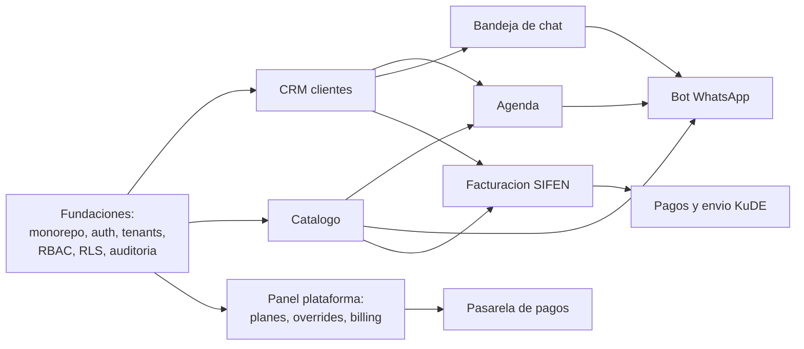

# 07 · Development Roadmap
## Fases, orden de desarrollo, estándares y entregables

Supuesto de capacidad para las estimaciones: **una persona full-time equivalente trabajando con Claude Code** (vos coordinando, agente padre + subagentes, más las horas que sumes). Los rangos son honestos: la variable dominante es SIFEN (trámites y homologación corren en paralelo al código). Alineado con la hoja de ruta de negocio de la propuesta: F1 = producto mínimo vendible, F2 = diferenciales, F3 = escala comercial.

---

## 1. Mapa de dependencias (por qué este orden)



Regla de oro: **las fundaciones multitenant se construyen primero y completas** (auth, RLS, guards, auditoría, CI con suite de aislamiento). Todo módulo posterior nace adentro de ese marco; nada se "multitenantiza" después.

## 2. Fases

### Fase 0 · Preparación (2 a 3 semanas, en paralelo con decisiones de negocio)

- Monorepo pnpm + Turborepo, apps y packages vacíos pero compilando; CI completo desde el día uno (lint, typecheck, tests, build de imágenes).
- **Laboratorio local levantado (documento 11):** Postgres con el DDL completo, MinIO, ElasticMQ y Mailpit en el servidor local. Las fases 0 y 1 se desarrollan enteras acá, con costo de AWS cero.
- Terraform de la fase 1 **escrito y validado** (`terraform plan`), aplicado recién al cierre de la fase 1, cuando haga falta el primer staging público.
- `schema.prisma` inicial a partir del documento 03; migración base con RLS y triggers.
- **Trámites que arrancan ya porque tienen espera externa:** cuenta Meta Business y app de WhatsApp Cloud API (verificación de negocio), contacto con 2 o 3 proveedores homologados SIFEN para cotizar la opción B, inicio de habilitación como facturador electrónico de la propia plataforma.
- Entregable: pipeline desplegando un "hola mundo" autenticable en staging.

### Fase 1 · Producto mínimo vendible (6 a 8 semanas)

| Orden | Módulo | Incluye |
|---|---|---|
| 1 | **Auth y cuentas** | Login, refresh rotativo, reset, TOTP, invitaciones; alta de tenant con sucursal principal; roles root/admin/staff; guards de 3 capas |
| 2 | **Panel plataforma mínimo** | Alta y suspensión de tenants, planes y features como datos, overrides con nota |
| 3 | **CRM** | Fichas, búsqueda trigram, unicidad, merge, historial (vacío aún) |
| 4 | **Catálogo** | Categorías y servicios con precios e IVA |
| 5 | **Agenda** | Turnos, disponibilidad, confirmación manual y automática, cancelaciones, vista día/semana |
| 6 | **Configuración** | Datos de empresa, logo, notification_emails, SMTP del tenant con prueba de envío |

Criterio de cierre de fase: una peluquería real puede operar su día (clientes + agenda + notificaciones por email) y la suite de aislamiento pasa. **Con esto ya se sale a vender el plan Estándar.**

### Fase 2 · Diferenciales (8 a 10 semanas)

| Orden | Módulo | Incluye |
|---|---|---|
| 1 | **Bandeja de chat** | Webhook WhatsApp verificado, conversaciones, mensajes, SSE en vivo, envío como agente, vinculación a clientes |
| 2 | **Bot** | Motor con Claude + tools por permisos, instrucciones texto + archivo en S3, presupuesto de tokens, pausar/reanudar, agendamiento por bot |
| 3 | **Facturación** | Borradores, emisión vía `InvoicingProvider` (opción B recomendada), numeración con lock, KuDE PDF, anulación 48 h, nota de crédito, email de aviso |
| 4 | **Pagos y envío** | Registro de pagos, disparo de KuDE por WhatsApp/email según preferencia |

Criterio de cierre: el flujo completo de la demo comercial (cliente pregunta precio al bot, agenda, se atiende, se factura, recibe su KuDE) corre de punta a punta con datos reales de un tenant piloto. **Habilita los planes Plus y Enterprise.**

### Fase 3 · Escala comercial (4 a 6 semanas)

- Suscripciones y facturación automática de la plataforma a tenants; integración de pasarela (Bancard u otra, según decisión pendiente); suspensión automática por impago con avisos.
- Sucursales en serio para cadenas: `user_branch_access` en la UI, reportes consolidados de cuenta madre.
- Sincronización Google Calendar (si se confirma la decisión pendiente de calendario).
- Hardening de la fase de escala que las métricas pidan (documento 06, sección 2).

### Después (backlog ya identificado)

App móvil (Capacitor sobre la web), bot premium propio (punto abierto de negocio), recursos agendables por empleado, reportes avanzados, exportaciones ARCO automatizadas, opción A de SIFEN si el volumen la justifica.

**Total estimado hasta cerrar Fase 3: 5 a 6 meses calendario.**

## 3. Estructura del repositorio

```
pymes-saas/
  apps/
    web/                  Next.js 15
    api/                  NestJS
    worker/               NestJS standalone
  packages/
    db/                   schema.prisma, migraciones, seeds
    shared/               tipos, zod, constantes, env
    invoicing/            InvoicingProvider + implementaciones
    wa/                   cliente WhatsApp Cloud API
    botengine/            orquestacion Claude + tools
  infra/                  Terraform
  docs/
    plan/                 ESTE PLAN (los 9 documentos + README)
    adr/                  Architecture Decision Records
  .github/workflows/      CI/CD
  CLAUDE.md               contexto para Claude Code (referencia docs/plan)
  docker-compose.yml      desarrollo local
```

## 4. Estándares de código

- TypeScript `strict`; ESLint + Prettier con config compartida; imports ordenados; sin `any` salvo justificado con comentario.
- Convención de commits: Conventional Commits (`feat:`, `fix:`, `chore:`); PRs chicos (ideal menos de 400 líneas de diff) con la plantilla: qué, por qué, cómo se probó.
- Toda regla de negocio vive en servicios (testeables), no en controllers ni en componentes React.
- Los DTOs zod de `packages/shared` son la única definición de formas de datos: API valida con ellos, el front tipa con ellos.
- Cambios de arquitectura respecto de este plan: ADR obligatorio en `docs/adr` (una página: contexto, decisión, consecuencias).
- `CLAUDE.md` en la raíz instruye a Claude Code: leer `docs/plan` como fuente de verdad, correr la suite de aislamiento antes de declarar terminada cualquier tarea que toque datos, y jamás editar migraciones ya aplicadas.

## 5. Entregables por fase (resumen ejecutivo)

| Fase | Entregable verificable |
|---|---|
| 0 | Pipeline verde desplegando a staging; Terraform aplicado; trámites externos iniciados |
| 1 | Demo vendible del plan Estándar con un tenant piloto real |
| 2 | Flujo completo bot + factura en producción con 2 o 3 tenants piloto |
| 3 | Cobro automático funcionando; primer cliente cadena con sucursales |
