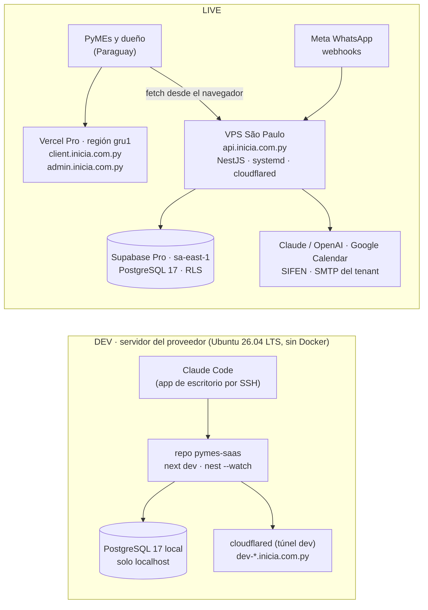

# Migración: servidor del proveedor como DEV, y LIVE en Vercel + Supabase — 2026-09-22

**Pedidos de Johan (2026-09-22):** (1) migrar el sistema a un host y decirle al
proveedor qué necesitamos (SO, CPU, RAM, disco, método de acceso); (2) seguir
trabajando desde Claude Code de escritorio, conectado al servidor por SSH;
(3) sistema lo más actualizado posible; (4) **sin Docker** en el servidor;
(5) optimizar recursos sin quedarse corto en el corto plazo; (6) mover Postgres
a Supabase; (7) saber si el proyecto puede subirse a Vercel; (8) usar el
servidor del proveedor como **entorno DEV** y llevar el **LIVE a Vercel +
Supabase**. El proyecto de fidelidad queda fuera de este dimensionamiento.

**Estado (2026-09-29):** la parte **DEV** se ejecutó: servidor nativo sin
Docker, Postgres 17 local y copia de la base del laboratorio. Desde el
2026-09-29 sirve `client/admin/api.inicia.com.py` y quedó registrada como
[ADR 0015](../adr/0015-servidor-propio-sin-docker.md); la operación está en
[docs/operacion/servidor.md](../operacion/servidor.md). El **LIVE** (Vercel +
Supabase + VPS) sigue pendiente de decisión.

**Estado original:** propuesta, pendiente de aprobación. Es un desvío de
[docs/plan/06](../plan/06-Infrastructure-Deployment-Diagram.md) (AWS EC2 +
RDS) y de [docs/plan/11](../plan/11-Local-Development-Environment.md)
(laboratorio Docker): al aprobarse se registra como **ADR 0015** y se
actualizan esos dos documentos, el README, la sección "Laboratorio local" de
`CLAUDE.md` y `accesos-y-urls.txt`.

---

## 1. Resumen ejecutivo

| Pregunta | Respuesta corta |
|---|---|
| ¿Qué pedimos al proveedor? | **Ubuntu Server 26.04 LTS, 4 vCPU, 8 GB RAM (16 si el salto es barato), 100 GB NVMe, acceso SSH con clave.** Texto listo en §4. |
| ¿Docker? | No. Todo nativo: Node 24 LTS por `fnm`, pnpm con su instalador (no corepack), PostgreSQL 17 del repositorio oficial, servicios `systemd`, `cloudflared` nativo. |
| ¿Supabase? | **Sí para LIVE** (plan Pro, región São Paulo `sa-east-1`, Postgres 17). En DEV, Postgres 17 local en el servidor (gratis, sin latencia, misma versión mayor que Supabase). |
| ¿Vercel? | **Sí para el frontend** (`apps/web`, dos proyectos: clientes y admin). **No para la API ni el worker**: necesitan un proceso persistente (SSE en memoria, 6 barridos con `setInterval`, bot de decenas de segundos). |
| ¿Dónde corre la API en LIVE? | En un **VPS pequeño en São Paulo** (2 vCPU / 4 GB), al lado de Supabase, como servicio `systemd` detrás de `cloudflared`. Alternativa: Fly.io región `gru`. |
| ¿Cuánto cuesta LIVE? | Fijo ≈ **60–73 USD/mes** (Vercel Pro 20 + Supabase Pro 25 + VPS 15–24 + IPv4 opcional 4), más el servidor DEV del proveedor y los costos variables (tokens de IA + conversaciones de WhatsApp). |

Principio que ordena todo: **el código de la API no se rediseña en esta
iteración.** Se elige la topología que lo corre tal como es (un proceso Node
24×7 junto a la base) y se registran como deuda las piezas que impedirían
escalar horizontalmente (§12).

---

## 2. Inventario del entorno actual (medido el 2026-09-22)

- **Código:** WSL Ubuntu 26.04 en la PC de Johan, `/home/johan/proyectos/pymes-saas`
  (repo `GohanKpy/SaaSPymes`). Monorepo pnpm 10.34.5 + Turborepo, `engines.node >= 22`.
- **Laboratorio:** `docker-compose.dev.yml` en Docker Desktop, puertos 4300–4308.
  Contenedores: web (141 MB RSS), webadmin (124 MB), api (106 MB), worker
  (35 MB, solo heartbeat), `postgres:16` (271 MB; base `pymes` de **282 MB**,
  52 tablas, extensiones `citext` y `pg_trgm`), MinIO (136 KB: vacío),
  ElasticMQ, Mailpit y `cloudflared` (túnel `pymes-lab` →
  `admin.inicia.com.py`, `client.inicia.com.py`).
- **Lo que el código usa de verdad:** Postgres (Prisma 6.19, multi-schema
  `control` + `app`, RLS `FORCE`, roles `migrator` / `app_rw` / `platform_ops`
  sin `BYPASSRLS`), SMTP (nodemailer, con el SMTP del tenant en producción),
  APIs externas (Meta, Claude/OpenAI, Google Calendar, DNIT). **No hay código
  S3 ni SQS** (ningún `@aws-sdk` en el repo); las fotos del catálogo se
  guardan como bytes en Postgres (`ServicePhoto`). MinIO y ElasticMQ no se
  migran a ningún lado.
- **Frontend → API:** el navegador llama a la API directamente
  (`apps/web/lib/api.ts`, `NEXT_PUBLIC_API_URL`); Next no hace fetch a la API
  en el servidor. Cookies de auth `host-only`, `sameSite: strict`, mismo
  sitio registrable (`inicia.com.py`).
- **API = proceso persistente por diseño:** SSE con `Subject` en memoria
  (`apps/api/src/conversations/events.service.ts`), seis barridos con
  `setInterval` (billing, google-calendar, recurring, reminders, inactivity,
  ruc-padron), debounce del bot con `setTimeout`, `pg_advisory_xact_lock`
  (transaccional). Ninguno de estos corre en funciones serverless.
- **PC actual:** Windows 10 Pro, Xeon E3-1225 v3 (4 núcleos), 16 GB, WSL con
  7.7 GB asignados. En la misma PC corre otro producto (TurboShop / TS-Web
  con SQL Server 2022) que **no forma parte** de esta migración.
- **Medición de build en el laboratorio actual:** ver §8.4.

---

## 3. Topología propuesta



- **DEV y LIVE en máquinas distintas.** Se descartó alojar la API de
  producción en el mismo servidor DEV: un build en paralelo (1.7 GB medidos,
  §8.4), dos `next dev` o el propio agente pueden disparar el OOM killer
  contra la API, los secretos de
  producción quedarían junto al entorno de desarrollo, y la latencia
  API↔Supabase dependería de dónde esté físicamente el servidor del
  proveedor. Solo se admite como plan B temporal (§7.5).
- **Todo LIVE en São Paulo.** Latencia media desde Asunción: São Paulo
  24 ms, Miami 156 ms, Virginia 199 ms. La API debe vivir en la misma región
  que la base porque cada endpoint hace varias consultas secuenciales.
- **El worker no se despliega en LIVE todavía** (no depende de `@pymes/db` y
  solo loguea un heartbeat). Se suma cuando tenga trabajo real.

---

## 4. Respuesta al proveedor (texto listo para enviar)

> **Sistema operativo:** Ubuntu Server 26.04 LTS, 64 bits, instalación mínima,
> sin panel de control (sin cPanel/Plesk). Si no lo tienen en catálogo,
> Ubuntu Server 24.04 LTS.
>
> **Procesador:** 4 vCPU x86-64, preferentemente núcleos dedicados o no
> limitados por créditos de ráfaga. ARM64 también nos sirve si resulta más
> económico.
>
> **Memoria RAM:** 8 GB. Si el salto a 16 GB tiene un costo bajo, preferimos
> 16 GB.
>
> **Disco:** 100 GB NVMe/SSD. (Mínimo 80 GB.)
>
> **Acceso:** Linux por SSH, autenticación por clave pública (les enviamos
> nuestra clave), un usuario con privilegios `sudo`. No necesitamos AnyDesk ni
> escritorio remoto.
>
> **Uso previsto:** servidor de desarrollo y pruebas de nuestra plataforma
> (Node.js + PostgreSQL). El servidor no expone servicios públicos: solo el
> puerto 22 entrante; todo lo demás sale por túnel cifrado.
>
> **Necesitamos que nos confirmen:**
> 1. País y ciudad del datacenter.
> 2. IP pública fija IPv4, y si ofrecen IPv6.
> 3. Si es máquina virtual (KVM) o servidor físico, y si se puede ampliar RAM
>    y disco más adelante sin reinstalar.
> 4. Snapshots o backups automáticos incluidos y su frecuencia.
> 5. Consola de emergencia (KVM/VNC/serial) por si perdemos el acceso SSH.
> 6. Ancho de banda y tráfico mensual incluido (buscamos ≥ 100 Mbps y
>    ≥ 2 TB/mes).
> 7. Que podamos administrar nuestro propio firewall (ufw) y que no haya
>    restricciones de salida (necesitamos alcanzar APIs externas por 443).
> 8. Si además tienen ubicación en São Paulo (Brasil) para un segundo
>    servidor pequeño (2 vCPU / 4 GB / 40 GB) que usaríamos para producción.

Por qué estas cifras (DEV solo, con builds y el agente en el mismo host):

| Componente en DEV | Reposo | Pico |
|---|---|---|
| `next dev` × 2 portales (TypeScript) | 1–2 GB c/u | — |
| Builds (medidos, §8.4): web 0.9 GB, API 0.9 GB, ambos en paralelo 1.7 GB | — | 1.7 GB |
| API `nest start --watch` + worker | 0.3–0.5 GB | — |
| PostgreSQL 17 (`shared_buffers` 1 GB) | 0.5–1 GB | — |
| Claude Code en el servidor (Anthropic pide 4 GB+ de máquina) | 0.5–1 GB | más con subagentes |
| SO + journald + cloudflared + fail2ban | 0.5 GB | — |
| **Total** | **≈ 4–6 GB** | **≈ 6–8 GB** |

Con los builds medidos, **8 GB alcanza para DEV** con swap de 4 GB y
`turbo --concurrency=2`; el pico lo ponen los dos `next dev` y Claude Code,
no los builds. 16 GB elimina toda disciplina y suele ser el tier siguiente
en los proveedores: pedirlo si la diferencia de precio es chica, no como
requisito. 4 vCPU para que el `typecheck` y los builds no bloqueen la sesión
SSH. 100 GB cubre `node_modules` + store de pnpm + `.next`
+ caché de turbo (20–40 GB) + Postgres + logs + swap con margen; sin la
caché de imágenes de Docker (24 GB hoy) no hace falta más.

---

## 5. Vercel (frontend)

**Sí sube, tal como está.** Root Directory `apps/web`, pnpm workspaces +
Turborepo soportados, Node 22. `apps/web/middleware.ts` ya particiona por la
variable `PORTAL`, así que se crean **dos proyectos Vercel sobre el mismo
repo y el mismo root**: `PORTAL=client` → `client.inicia.com.py`,
`PORTAL=admin` → `admin.inicia.com.py`. Dos bundles físicamente separados,
coherente con ADR 0004 ("desde un portal no se puede ni ver el otro").
Importar el mismo repo dos veces con variables distintas está confirmado en
el foro de Vercel, no en la documentación oficial: si diera problemas, la
alternativa es un solo proyecto derivando el portal del `host` en el
middleware, lo que habría que aprobar como cambio al ADR 0004.

Condiciones y ajustes:

1. **Plan Pro (20 USD/mes/asiento).** El plan Hobby prohíbe uso comercial y
   la región `gru1` (São Paulo) solo está en Pro.
2. **Región de funciones `gru1`** en `vercel.json` de ambos proyectos.
3. **Install Command** `pnpm install --filter @pymes/web... --frozen-lockfile`
   (evita compilar `argon2`, `sharp` y los engines de Prisma de la API en
   cada build); **Ignored Build Step** `npx turbo-ignore`.
4. **Variables:** `PORTAL`, `NEXT_PUBLIC_API_URL=https://api.inicia.com.py`
   (la derivación automática `api.<dominio>` de `lib/api.ts` no sirve en
   `*.vercel.app`). **No** definir `META_APP_SECRET` ni `ALLOW_WEBCHAT` (el
   simulador `app/chat/send/route.ts` queda apagado en producción).
5. **DNS:** los CNAME de `client.` y `admin.` hacia Vercel van en Cloudflare
   en modo **DNS-only (nube gris)** para que Vercel emita el certificado.
6. **Protección del portal admin.** ADR 0004 confiaba la restricción por IP a
   Cloudflare Access/WAF sobre `admin.<dominio>`; con nube gris esa capa
   desaparece. Reemplazo: **reglas del WAF de Vercel** (incluidas en Pro:
   denegar salvo lista de IPs/país, rate limit en `/platform/login`) más la
   segunda capa que ya existe en la API (`PLATFORM_ALLOWED_IPS`). Registrar
   el cambio en ADR 0004 al aprobar.
7. **Previews:** en `*.vercel.app` no se puede iniciar sesión (cookie
   cross-site + CORS solo acepta `WEB_ORIGIN`). Se acepta, o se define un
   dominio de preview propio incluido en el `WEB_ORIGIN` de la API de DEV.

Qué **no** va a Vercel: `apps/api` y `apps/worker`. Vercel Functions no son
un proceso persistente: ninguna instancia comparte memoria (el SSE en memoria
se rompe con dos instancias), cada stream muere a los 300 s (Hobby) /
800 s (Pro), y los `setInterval` no corren entre requests. Adaptarlo
(Supabase Realtime para SSE, Vercel Queues para el bot, Vercel Cron para los
barridos) es un rediseño de tres piezas sobre funcionalidades en beta:
descartado para esta iteración.

---

## 6. Supabase (base de datos LIVE)

- **Plan Pro** (25 USD/mes: 8 GB de disco, backups diarios con 7 días,
  crédito que cubre el compute Micro). El plan Free se pausa tras 7 días sin
  actividad y no tiene backups: sirve solo como **staging** para validar el
  esquema (§11, fase 0).
- **Región `sa-east-1` (São Paulo)**; no se puede cambiar después. Postgres
  17 (versión con la que Supabase crea proyectos nuevos).
- **Roles propios.** El rol `postgres` de Supabase no es superuser pero tiene
  `BYPASSRLS`: la API **nunca** se conecta como `postgres`. Se crean por SQL
  `migrator`, `app_rw` y `platform_ops` con `LOGIN PASSWORD` y sin
  `BYPASSRLS` (permitido). Lo que hoy hace `infra/local/init/01-schema.sql`
  hay que reproducirlo a mano antes del primer `prisma migrate deploy`:
  extensiones, schemas `control`/`app` con owner `migrator`, grants,
  `ALTER DEFAULT PRIVILEGES`, funciones utilitarias. Tres diferencias con el
  laboratorio: `ALTER DEFAULT PRIVILEGES FOR ROLE migrator` exige antes
  `GRANT migrator TO postgres` (no hay superusuario); en Supabase las
  extensiones viven en el schema `extensions`
  (las migraciones usan `citext` sin calificar → `CREATE EXTENSION citext
  SCHEMA public` o `ALTER ROLE ... SET search_path = public, extensions`), y
  la base se llama `postgres`, no `pymes`.
- **Conexión desde la API (VPS):** la guía oficial Prisma + Supabase para
  servidores persistentes recomienda el pooler Supavisor en **modo session**
  (puerto 5432, IPv4, usuario `app_rw.<project-ref>`): conserva prepared
  statements y no depende de IPv6. Alternativa: conexión directa por IPv6
  (Vultr/Lightsail/Hostinger la dan) o add-on IPv4 (4 USD/mes). El modo
  transaction (6543) también es compatible con el código
  (`set_config(..., true)` y `pg_advisory_xact_lock` son transaccionales)
  pero queda solo como plan B documentado. Hay reportes de fallos de
  autenticación de roles propios por el pooler: **probarlo en el proyecto
  staging** antes de decidir. Activar **Network Restrictions** al IP de
  salida del VPS y **Enforce SSL**; MFA en la cuenta de Supabase.
- **Prisma:** `DATABASE_URL` (app_rw) y `PLATFORM_DATABASE_URL`
  (platform_ops) con `sslmode=require` y `connection_limit` explícito (8 y 4:
  el compute Micro admite 60 conexiones directas); `MIGRATOR_DATABASE_URL`
  a la conexión directa, usada solo desde el pipeline de deploy (§7.3),
  nunca almacenada en el VPS ni en el servidor DEV.
- **Datos:** LIVE arranca limpio (`prisma migrate deploy` como `migrator` +
  seed del admin de plataforma). La base del laboratorio es de prueba; si
  algún tenant se quiere conservar, exportar solo datos con el cliente de
  PG 17 (`pg_dump --data-only --format=directory --no-owner
  --no-privileges`) y restaurar **como `postgres`** (único rol con
  `BYPASSRLS`; con RLS `FORCE` un restore como `migrator` o `app_rw` falla),
  luego `VACUUM ANALYZE`. La suite de aislamiento asume hoy la misma
  contraseña para los tres roles y usuarios sin sufijo `.<ref>`: adaptarla
  antes de correrla contra Supabase, y correrla **solo contra staging**
  (crea tenants y ejecuta SQL destructivo).
- **Backups y RPO.** docs/plan/06 pedía PITR de 7 días; Supabase Pro da
  backup diario (RPO 24 h) y el PITR cuesta 100 USD/mes. Con facturas SIFEN
  en la base eso no alcanza: **`pg_dump` cada hora desde el VPS** (timer
  systemd, rol `platform_ops`) hacia Supabase Storage o Cloudflare R2 con
  retención 30 días (RPO 1 h, costo ≈ 0) y un **simulacro de restauración**
  antes del go-live. Guardar aparte, en un gestor de contraseñas, la clave
  de cifrado envelope (`CRYPTO_PROVIDER=local`) y las claves JWT: sin la
  clave de cifrado, el backup de `integration_credentials` y
  `platform_settings` es ilegible.
- Desactivar la Data API (PostgREST) del proyecto: nada la usa.

---

## 7. API y worker en LIVE (VPS São Paulo)

### 7.1 Por qué un VPS y no un PaaS

Ningún PaaS "push-to-deploy" clásico tiene región en Sudamérica (Railway,
Render, Koyeb, DigitalOcean: la más cercana es Virginia, 199 ms). Fly.io sí
tiene `gru` pero exige dos Dockerfiles para el monorepo y deploy con
`flyctl`; queda como **alternativa** si el VPS resulta incómodo. El VPS usa
exactamente el mismo runbook que el servidor DEV (systemd + fnm +
cloudflared), o sea una sola habilidad operativa para las dos máquinas.

Opciones con São Paulo (precios de lista, 2026-09): Vultr 2 vCPU/4 GB
≈ 20 USD/mes; AWS Lightsail 2 vCPU/4 GB 24 USD; Hostinger KVM 2 (2 vCPU/8 GB)
8.99 USD promocional **solo con prepago de 24 meses** (renueva a 14.99);
Akamai/Linode 2 vCPU/4 GB 33.60 USD. Recomendación: mensual sin compromiso
el primer año (Vultr o Lightsail) y decidir prepago con datos.

### 7.2 Layout en el VPS

- Usuario `pymes` sin shell interactivo para los servicios; código en
  `/srv/pymes/releases/<tag>` con symlink `current`; secretos en
  `/etc/pymes/api.env` (`root:pymes 0640`) cargados con `EnvironmentFile=`.
- `pymes-api.service`: `ExecStart=/home/pymes/.fnm/.../node apps/api/dist/main.js`,
  `Restart=always`, `TimeoutStopSec=60` (deja terminar respuestas del bot en
  vuelo), `MemoryMax=1500M`. **Un solo proceso**: sin pm2 cluster, sin dos
  releases solapadas (los seis barridos duplicarían recordatorios y
  facturas).
- `cloudflared` nativo (paquete del repositorio de Cloudflare, dist `any`)
  con un **túnel nuevo, exclusivo de producción** → `api.inicia.com.py` →
  `127.0.0.1:4301`. Nunca reutilizar el `TUNNEL_TOKEN` del laboratorio: dos
  conectores con el mismo token balancean tráfico entre ambos orígenes (y
  ambas bases). La API escucha solo en `127.0.0.1`; el VPS no abre 80/443,
  solo SSH (`ufw default deny incoming`). Regla WAF "skip" en Cloudflare
  para `/api/v1/webhooks/*` (Bot Fight Mode bloquea POSTs de Meta).
- `trustProxy: ['127.0.0.1', '::1']` en `apps/api/src/app.factory.ts` y la IP
  real desde `CF-Connecting-IP` (hoy `trustProxy: true` acepta cualquier
  `X-Forwarded-For`).
- **Node 24 LTS** pinneado con `fnm` (Active LTS, fin de vida 2028-04-30;
  compatible con Next 15.5, NestJS 11 y Prisma 6.19). Node 22 ya está en
  mantenimiento (fin 2027-04-30) y la paridad con `node:22-alpine` deja de
  importar sin Docker. Antes de adoptarlo: correr el CI con matriz 22/24.
  pnpm 10.34.5 con `npm i -g pnpm@10.34.5` o el instalador standalone, no
  con corepack (experimental en 24, retirado de Node 25+).
- Unidad con `TZ=America/Asuncion` (los barridos internos dependen de la
  hora local), `Restart=always`, `OOMScoreAdjust=-500`. `unattended-upgrades`
  con reinicio automático solo en una ventana nocturna.

### 7.3 Deploy

Al pushear un tag `v*`, una GitHub Action entra por SSH con una deploy key
limitada (sudoers restringido a `systemctl restart pymes-api`) y ejecuta:

```bash
git fetch --tags && git checkout <tag>
pnpm install --frozen-lockfile
pnpm turbo build --filter=@pymes/api...
pnpm --filter @pymes/db exec prisma migrate deploy   # MIGRATOR_DATABASE_URL como secret de GitHub
sudo systemctl restart pymes-api
curl -fsS http://127.0.0.1:4301/health              # con probe de base
```

Rollback = `git checkout <tag anterior>` + build + restart (las migraciones
son expand-and-contract, regla ya vigente). Construir en el VPS (solo
`nest build`, sin Next) es más simple para una persona que armar artefactos
(`pnpm deploy` en pnpm 10 exige `inject-workspace-packages` y el CLI de
Prisma es devDependency).

### 7.4 Backing services que el `env.ts` exige y hoy son contenedores

| Variable | LIVE |
|---|---|
| `S3_ENDPOINT`, `SQS_ENDPOINT`, `AWS_*` | hacerlas **opcionales en `env.ts`** (hoy son obligatorias aunque nada las use) en vez de inventar valores de relleno; **no contratar Storage/R2/SQS** hasta que exista código que los use. Cuando el worker necesite cola, preferir una cola en Postgres (pgmq de Supabase o pg-boss; requiere modo session) antes que abrir una cuenta AWS solo para SQS |
| `SMTP_HOST` | correo **de plataforma** (reset de contraseña, invitaciones, avisos): proveedor transaccional real con tier gratuito (Resend/Brevo); el correo de cada tenant sale por su propio SMTP |
| `CRYPTO_PROVIDER` | `local` con clave en `/etc/pymes/api.env` (KMS cuando haya AWS) |
| `WHATSAPP_API_URL` | `https://graph.facebook.com` |

### 7.5 Plan B (solo si el presupuesto no da para el VPS)

API de producción en el mismo servidor DEV con usuarios Linux separados,
`prod.slice` (`CPUWeight=1000`, `MemoryLow=2G`, `MemoryMax=3G`) y
`dev.slice` (`MemoryHigh=8G`), túneles y credenciales separados, deploy solo
por pipeline, y **fecha de caducidad escrita** (primer cliente pagando).
Requiere el servidor de 16 GB y que el datacenter del proveedor esté en São
Paulo (si no, la latencia a Supabase lo invalida aunque el hardware alcance).

---

## 8. Servidor DEV sin Docker

### 8.1 Base

- **Ubuntu Server 26.04 LTS** (Resolute Raccoon; 26.04.1 publicado en
  agosto 2026). Repositorios de terceros verificados para 26.04: PostgreSQL
  (`resolute-pgdg` en apt.postgresql.org) y cloudflared (dist `any`). Node no
  depende de repositorios: Node 24 LTS se instala con `fnm` por usuario. Es la misma
  versión que corre hoy en la WSL de Johan.
- Usuario `johan` con `sudo` para administrar y usuario `dev` sin `sudo`
  para las sesiones de Claude Code (sudoers acotado a `systemctl` y
  `journalctl` de las unidades de desarrollo). SSH solo por clave ed25519
  (`PasswordAuthentication no`, `PermitRootLogin no`), `ufw default deny` +
  `ufw limit ssh`, `fail2ban`, `unattended-upgrades`, swap de 4 GB, zona
  horaria `America/Asuncion`, `journald` con tope de tamaño. Opcional y
  gratis: cerrar el 22 público y entrar por Tailscale SSH o Cloudflare
  Access; ambos funcionan con el diálogo SSH de la app de escritorio.
- **Claude Code:** la app de escritorio se conecta por SSH (host, usuario,
  puerto, carpeta inicial) e instala Claude Code en el servidor
  automáticamente en la primera conexión (instalador nativo, no requiere
  Node). El panel de terminal integrado está deshabilitado en sesiones
  remotas; la terminal es la del propio servidor. Ningún secreto de LIVE se
  guarda en este servidor.

### 8.2 Qué reemplaza a `docker-compose.dev.yml`

| Contenedor hoy | En el servidor DEV |
|---|---|
| `db` (postgres:16) | `postgresql-17` del repositorio oficial, escuchando solo en `localhost`, base `pymes`, mismo `01-schema.sql` (roles y extensiones); `shared_buffers` 1 GB |
| `api`, `worker`, `web`, `webadmin` | `pnpm dev` (turbo) desde la sesión, o unidades `systemd --user` si se quiere que sigan vivos sin sesión: `pymes-dev-api`, `pymes-dev-web` (PORT 4300), `pymes-dev-webadmin` (4308) |
| `mail` (Mailpit) | binario oficial de Mailpit como servicio de usuario (SMTP 4306, UI 4307) |
| `minio`, `queue` | **no se instalan** (sin uso en el código) |
| `tunnel` | `cloudflared` nativo con el túnel `pymes-lab` actual → `dev-client.` / `dev-admin.inicia.com.py` (los hostnames `client.` y `admin.` pasan a LIVE) |

Se mantiene el bloque de puertos 4300–4308 (ADR 0001) y se agrega
`infra/dev/instalar.sh` idempotente para reconstruir el servidor.

### 8.3 Disciplina de recursos

`turbo --concurrency=2`, `NODE_OPTIONS=--max-old-space-size=3072` para
builds, `experimental.webpackMemoryOptimizations: true` en `next.config.mjs`,
y `PS1` con color/hostname distinto en DEV y en el VPS de LIVE.

### 8.4 Medición de build en el laboratorio actual

Pico de memoria residente medido con `/usr/bin/time -v` sobre el repo actual
(mismo código que irá al servidor):

Medido el 2026-09-22 en la WSL actual (4 núcleos, 7.7 GB) sumando la RSS de
**todo el árbol de procesos** cada 0,5 s (cota superior: las páginas
compartidas se cuentan varias veces). Con `/usr/bin/time -v`, que solo ve
el proceso más grande, los picos fueron 479 MB (web) y 812 MB (API).

| Comando | Pico RSS agregado | Tiempo |
|---|---|---|
| `pnpm --filter @pymes/web run build` | 902 MB | 49 s |
| `pnpm --filter @pymes/api run build` | 895 MB | 19 s |
| `pnpm turbo build --filter=@pymes/web --filter=@pymes/api --concurrency=2` | 1 692 MB | 50 s |

Conclusión: los builds de este monorepo **no** son el pico de memoria de DEV;
lo dominan los dos `next dev` con TypeScript y Claude Code. Con 8 GB y swap
de 4 GB el servidor DEV trabaja holgado; 16 GB queda como comodidad, no
como necesidad.

---

## 9. Cambios de código necesarios (ninguno es rediseño)

| Archivo | Cambio | Motivo |
|---|---|---|
| `apps/api/src/conversations/events.service.ts` | `merge(subject, interval(20 s) → ping)` con `startWith(ping)` | NestJS no envía cabeceras SSE hasta el primer evento y Cloudflare corta a los 125 s sin datos: la bandeja queda muerta en silencio (probablemente ya pasa hoy por el túnel) |
| `apps/web/app/app/inbox/page.tsx`, `schedule/page.tsx` | hook `useSse` que en `error` con `readyState === CLOSED` refresca el token y recrea el `EventSource` | el JWT de 15 min viaja en la URL; la reconexión automática del navegador manda un token vencido |
| `apps/api/src/app.factory.ts` | `trustProxy: ['127.0.0.1','::1']` + `CF-Connecting-IP`; `WEB_ORIGIN` con los dos dominios | evitar spoofing del lockout y del rate limit; CORS |
| `packages/db/src/index.ts` / `env.ts` | `connection_limit`, `sslmode=require`; colapsar los 6 `set_config` de `tenantTx` en **un** `SELECT` | 60 conexiones en Micro; 6 round-trips menos por transacción |
| `apps/api/src/health.controller.ts` | `/health` con `SELECT 1` vía Prisma | healthcheck del deploy y del monitor externo |
| `apps/web/middleware.ts` | matcher que excluya assets estáticos (`.*\..*`) | no facturar middleware por archivos de `public/` |
| `apps/web/next.config.mjs` | `experimental.webpackMemoryOptimizations` | builds en DEV |
| `packages/shared/src/env.ts` | `S3_*`, `SQS_*` y `AWS_*` opcionales | nada las usa; evita secretos de relleno en cada servidor |
| `packages/db/prisma/schema.prisma` | quitar `linux-musl-openssl-3.0.x` de `binaryTargets` | ya no hay Alpine; descarga un engine inútil |
| `apps/api/src/main.ts` | `API_HOST` configurable, `127.0.0.1` detrás de cloudflared | hoy escucha en `0.0.0.0` |
| `packages/db/src/tests/isolation.test.ts` | URLs por rol con contraseñas distintas y usuario `rol.<ref>` | hoy asume la misma contraseña para los tres roles |
| `infra/live/` (nuevo) | unidades systemd, `instalar.sh`, script `01-schema-supabase.sql` | reproducible |
| `infra/dev/` (nuevo) | `instalar.sh` del servidor DEV, unidades de usuario, Mailpit | reemplaza al compose |
| `.github/workflows/deploy-api.yml` (nuevo) | pipeline de §7.3 | deploy por tag con migraciones |
| Docs | ADR 0015, docs/plan/06 y 11, README, `CLAUDE.md` (laboratorio), ADR 0004 (protección admin), `accesos-y-urls.txt` | fuente de verdad |

Verificado y **sin cambio**: cookies (`sameSite: strict` funciona entre
`client.`/`admin.` y `api.inicia.com.py`), webhook de Meta (`rawBody`,
responde 200 y despacha el bot fuera del request, dedupe por `waMessageId`),
compatibilidad del código con el pooler.

---

## 10. Costos

| Concepto | USD/mes |
|---|---|
| Vercel Pro (1 asiento, 2 proyectos, gru1) | 20 (incluye 20 de crédito de uso) |
| Supabase Pro (Micro, sa-east-1) | 25 (+4 si add-on IPv4) |
| VPS São Paulo 2 vCPU / 4 GB | 15–24 |
| Cloudflare (DNS, túneles, WAF básico) | 0 |
| Monitoreo (UptimeRobot / Better Stack free, Sentry free) | 0 |
| **LIVE fijo** | **60–73** |
| Servidor DEV del proveedor | según cotización |
| **Variable** | tokens de Claude/OpenAI del bot (ADR 0006 ya limita por tenant) + conversaciones de WhatsApp Cloud API: **estimar por cliente activo**; alertas de gasto en Anthropic/OpenAI, Vercel (bajar el tope de 200 USD) y Supabase (spend cap activo; con el cap activo, al agotar egress o disco el servicio se corta hasta el próximo ciclo, así que hacen falta alertas de uso) |

Referencia: docs/plan/06 estimaba 35–45 USD/mes en AWS fase 1. La diferencia
la explican Vercel Pro (obligatorio por uso comercial) y la separación
DEV/LIVE; a cambio no se opera RDS, S3, SQS ni Terraform.

---

## 11. Plan de ejecución

**Fase 0 · Antes de contratar (esta semana)**
1. Enviar §4 al proveedor y esperar las 8 respuestas (la ubicación del
   datacenter decide si el plan B de §7.5 es siquiera posible).
2. Medición de §8.4: hecha el 2026-09-22.
3. Crear un proyecto **Supabase Free "staging"** en `sa-east-1`: aplicar el
   script de roles/extensiones, `prisma migrate deploy`, correr la suite de
   aislamiento (`packages/db/src/tests/isolation.test.ts`) contra él, y
   probar login de `app_rw` por conexión directa y por pooler.
4. Aprobar esta propuesta → ADR 0015.

**Fase 1 · Servidor DEV (1–2 días)**
Instalación base (§8.1), `infra/dev/instalar.sh`, clonar el repo,
Postgres 17 con `01-schema.sql`, `pnpm install`, `pnpm dev`, túnel
`dev-*.inicia.com.py`, sesión de Claude Code por SSH funcionando.
Actualizar README y `CLAUDE.md`. A partir de acá el desarrollo ocurre en el
servidor; la WSL queda como respaldo hasta la fase 6 (subir su compose y el
CI a `postgres:17` para no perder paridad con Supabase).

**Fase 2 · Cambios de código (§9)** en DEV, con la suite de aislamiento en
verde. Tag `v0.x` de candidato.

**Fase 3 · Supabase LIVE**: proyecto Pro, roles, `migrate deploy`, seed del
admin, backup horario a Storage/R2, simulacro de restore.

**Fase 4 · API LIVE**: VPS, `infra/live/instalar.sh`, túnel de producción,
`/etc/pymes/api.env`, pipeline de deploy, primer deploy por tag, `/health`
monitoreado desde afuera.

**Fase 5 · Vercel**: dos proyectos, variables, `gru1`, dominios en DNS-only,
reglas WAF del portal admin, prueba completa de login, chat de prueba y
Google OAuth (redirect URI `https://api.inicia.com.py/api/v1/auth/google/callback`
ya existe).

**Fase 6 · Cutover (ventana corta, fuera de horario)**
1. Congelar cambios; TTL de DNS bajo desde el día anterior.
2. Apuntar el webhook de la app de Meta a
   `https://api.inicia.com.py/api/v1/webhooks/...` (Meta puede reenviar
   mensajes de hasta 7 días: el dedupe por `waMessageId` los absorbe).
3. Cambiar `client.`/`admin.` de túnel a Vercel; `api.` al túnel del VPS.
4. Verificar: login en ambos portales, SSE de la bandeja, un mensaje de
   WhatsApp real de punta a punta, emisión de factura de prueba, sync de
   calendario.
5. **Rollback** (< 15 min): volver a apuntar el túnel del laboratorio y el
   webhook de Meta al laboratorio; la base de LIVE queda intacta.
6. Rotar todo lo que vivió en el `.env.local` del laboratorio (contraseñas
   `devpass`, `TUNNEL_TOKEN`, tokens de Meta y Google, claves JWT): nada del
   laboratorio se reutiliza en LIVE.
7. Después: apagar el laboratorio Docker de la WSL, actualizar
   `accesos-y-urls.txt`, borrar hostnames viejos.

---

## 12. Riesgos y deuda que quedan registrados

- **La API es un único proceso** (estado en memoria + barridos sin advisory
  lock). Cada `systemctl restart` corta los SSE y las respuestas del bot en
  vuelo. Disparador para pagar la deuda: primer cliente que exija SLA →
  mover barridos al worker con `pg_try_advisory_lock` y SSE a
  `LISTEN/NOTIFY` (ya previsto en `events.service.ts`) o Supabase Realtime.
- **JWT en la query del SSE** queda en los access logs de Cloudflare/Caddy:
  redactar o pasar a ticket de un solo uso.
- **RPO 1 h** con el `pg_dump` horario (sin PITR). Aceptado hasta que el
  volumen de facturas justifique los 100 USD/mes.
- **Sin alta disponibilidad** en el VPS ni en Supabase Micro (igual que el
  plan original de fase 1).
- **Datos en Brasil** (Vercel gru1, Supabase sa-east-1, VPS SP): declararlo
  en la política de privacidad y contratos con las PyMEs; firmar los DPA de
  Vercel y Supabase. La Ley 7593/2025 (protección de datos, Paraguay) rige
  plenamente en noviembre de 2027.
- **Versiones:** Node 24 pasa a mantenimiento el 2026-10-20 y Node 26 será
  LTS el 2026-10-28; Prisma 6 está dos mayores por detrás (8.0 en RC). Con
  `fnm` el salto de Node es trivial; planificar las actualizaciones para que
  el servidor nuevo no nazca desactualizado.
- **Lock-in bajo**: Next.js se auto-hospeda (`output: standalone`) y
  Supabase es Postgres puro vía Prisma. Evitar prepagos de 24 meses el
  primer año.

---

## 13. Fuentes consultadas (2026-09-22)

- Ubuntu 26.04.1 LTS: https://lists.ubuntu.com/archives/ubuntu-announce/2026-August/000326.html · notas: https://documentation.ubuntu.com/release-notes/26.04/
- PGDG con `resolute-pgdg`: https://apt.postgresql.org/pub/repos/apt/dists/
- cloudflared apt (dist `any`): https://pkg.cloudflare.com/index.html
- Node.js calendario de releases: https://github.com/nodejs/Release
- Claude Code requisitos e instalador nativo: https://code.claude.com/docs/en/setup · sandbox: https://code.claude.com/docs/en/sandboxing
- Vercel: Hobby no comercial https://vercel.com/docs/plans/hobby · gru1 solo Pro https://vercel.com/docs/pricing/regional-pricing/gru1 · monorepos https://vercel.com/docs/monorepos/turborepo · límites de funciones https://vercel.com/docs/functions/limitations · realtime sin memoria compartida https://vercel.com/kb/guide/publish-and-subscribe-to-realtime-data-on-vercel · Cloudflare delante de Vercel https://vercel.com/kb/guide/cloudflare-with-vercel · WAF https://vercel.com/docs/vercel-firewall/vercel-waf/custom-rules
- Supabase: precios https://supabase.com/pricing · regiones https://supabase.com/docs/guides/platform/regions · conexiones https://supabase.com/docs/guides/database/connecting-to-postgres · Prisma https://supabase.com/docs/guides/database/prisma · roles https://supabase.com/docs/guides/database/postgres/roles · superuser https://supabase.com/docs/guides/database/postgres/roles-superuser · IPv4 https://supabase.com/docs/guides/platform/manage-your-usage/ipv4 · compute https://supabase.com/docs/guides/platform/compute-and-disk · backups https://supabase.com/docs/guides/platform/backups
- Latencias desde Asunción: https://wondernetwork.com/pings/Asuncion
- Regiones PaaS: Railway https://docs.railway.com/reference/regions · Render https://render.com/docs/regions · Fly.io https://fly.io/docs/reference/regions/ · precios Fly https://fly.io/docs/about/pricing/ · Lightsail https://aws.amazon.com/lightsail/pricing/ · Akamai SP https://www.akamai.com/cloud/pricing/sao-paulo/ · Hostinger https://www.hostinger.com/vps-hosting
- Meta webhooks (reintentos 7 días): https://developers.facebook.com/docs/whatsapp/cloud-api/guides/set-up-webhooks/
- Cloudflare timeouts (125 s): https://developers.cloudflare.com/fundamentals/reference/connection-limits/
- Next.js memoria: https://nextjs.org/docs/app/guides/memory-usage · Turborepo concurrencia: https://turborepo.dev/docs/reference/run
- systemd resource-control: https://man7.org/linux/man-pages/man5/systemd.resource-control.5.html
- Ley 7593/2025: https://www.bacn.gov.py/leyes-paraguayas/12924/ley-n-7593-2025-de-protecci-n-de-datos-personales-en-la-rep-blica-del-paraguay
